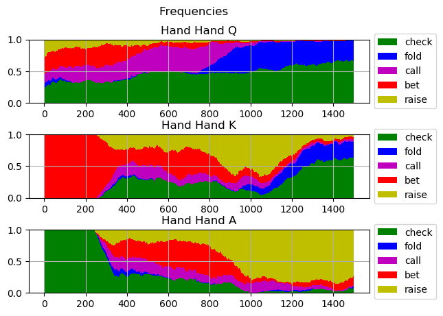
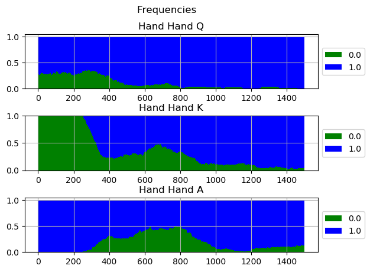
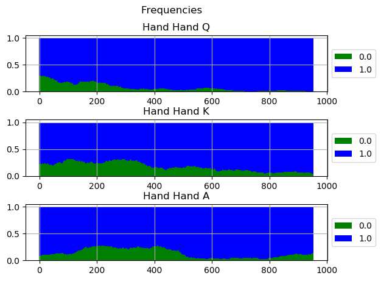
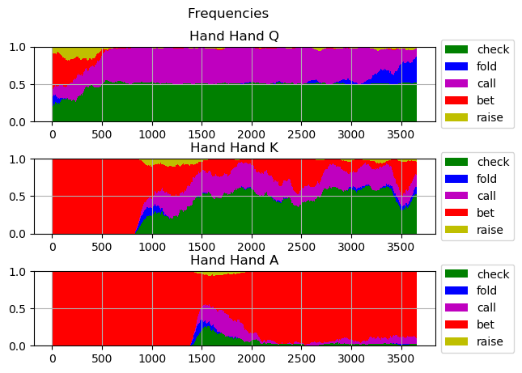
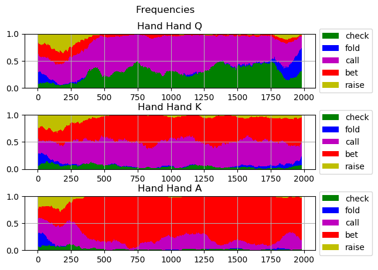
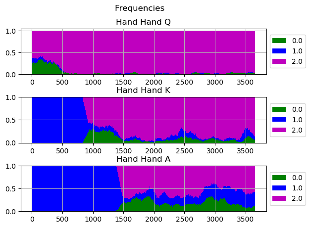
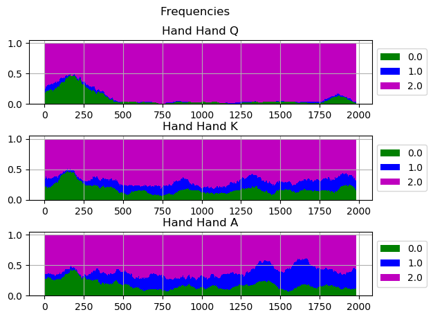

# Betsizing

In addition to outputting an action, if the action is bet or raise, we must also choose a bet size.

There are multiple ways to go about implementing this. Initially for the actor network, i was going to output a single vector of action categories. Which contains both the action categories like Fold, Raise, Check... but also contains the subcategories of bet 50% of pot, 100% of pot etc. 

An issue with this approach, is that each bet size is treated separately, initially the probabilities will be over all action categories and sub categories in a flat structure. This means initially betting will be by far the most probable action, and in order to reduce betting as a whole, it would be necessary to increase the probability of one of the other main action categories like folding/checking. As opposed to decreasing unsuccessful bets, which will increase the probability of other bets, leading to a wackamole situation, especially if the number of betsizes is large. 

A potential solution to this is to break the network into two sections, the first section computes a probability over categories and picks one. If the category is bet or raise and requires a betsize, then it continues into the next section which also outputs a betsize. Otherwise the betsize is 0. This seems like it should improve learning because it is easier for it to make a choice at the category level, instead of a blend of category and subcategory. 

A nice feature of this style of network is that the outputs are readily recognizable. An annoyance is the fact that we will have to check for none zero bets to perform betsize gradient updates which makes the learning process more complicated. And the network itself is more complicated. In order to update the network, we will have to have Q values for each betsize, to update the betsize frequencies appropriately. This means we either have a seperate network for evaluating betsizes, or our Q critic outputs two sets of values.

It also opens up the possibility of using a regressive output that avoids the descretization of betsizes. 

## Results

Encountered a weird error with two stage networks, where if the action sequence was 0,4,4,2 it would break. The error was the in-place modification of FloatTensor([5]). Which caused the FloatTensor to have version 1 when it expected version 0. Still have not found a solution. However the flat network works.

Flat network outputs, correctly choose betsize and actions as expected.

One interesting aspect to multiple sizes is that it allows for many actions in a row, and given the network representation of only the last action,last betsize and current hand. The network had no way of telling how many raises in a row had happened. This caused learning to crator with small betsizes, because there was no way to solve the credit assignment problem. So stacksizes must be relatively small and betsizes large to avoid the possibility of multiple raises. This will be accounted for when tackling the full game of poker.

The following graphs demonstrate the network approaching the solution.

## Two betsizes

### SB

### BB

### SB betsizes

### BB betsizes

## Three betsizes

### SB

### BB

### SB betsizes

### BB betsizes

